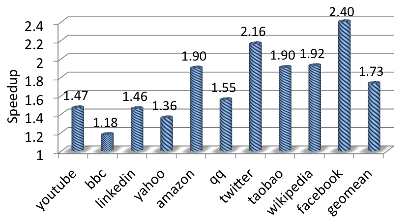

# HPar
**HPar** is a prototype of a data parallel HTML5 parser. It is based on the
popular HTML paser <a href="https://jsoup.org/">Jsoup</a>. With speculative
parallelization, HPar can even parse a single HTML file in parallel.

Fig. Speedup on MacBook Pro with a Quad-Core CPU

### Getting Started:

    ./compile.sh
	./run.sh      # output is /test/output.html

### How To Use:

    ParallelParser pparser = new ParallelParser(html, numThreads);
    doc = pparser.parse();

**Note:** The prototype is mainly for research purpose. Though it passed the
included test set (up to 8 threads), the current version does not guarantee
the resulted DOM tree is always the same as that from a sequential version. 

Reference:

    Zhao, Z., Bebenita, M., Herman, D., Sun, J., & Shen, X. (2013). 
    HPar: A practical parallel parser for HTML--taming HTML complexities for parallel parsing. 
    ACM Transactions on Architecture and Code Optimization (TACO), 10(4), 44.

BibTex:

    @article{zhao2013hpar,
      title={HPar: A practical parallel parser for HTML--taming HTML complexities for parallel parsing},
      author={Zhao, Zhijia and Bebenita, Michael and Herman, Dave and Sun, Jianhua and Shen, Xipeng},
      journal={ACM Transactions on Architecture and Code Optimization (TACO)},
      volume={10},
      number={4},
      pages={44},
      year={2013},
      publisher={ACM}
    }
